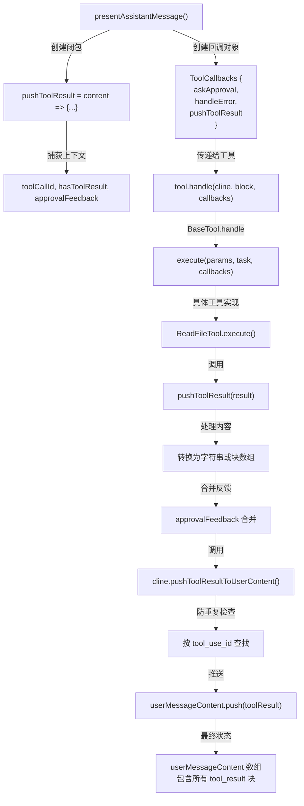

## CACHE METADATA

- ID: 22
- Created: 2026-02-02T10:53:54.601Z
- Git Commit: 16a1c266fbfd767a8d8f8cd647b01e9aa40d2281
- TTL: 168 hours

## QUERY

How is pushToolResult callback created and how does it add tool_result to userMessageContent? Where is the tool execution flow that creates ToolCallbacks?

## SCOPE

- Directories: /Users/wepie/Documents/pie/project/roo-code/src/core
- File Patterns: \*.ts
- Excludes: **tests**

## SCHEMA

```json
{
	"type": "object",
	"properties": {
		"files": { "type": "array", "items": { "type": "string" } },
		"pushToolResultCreation": { "type": "string" },
		"toolExecutionFlow": { "type": "string" }
	}
}
```

## RESULT

## 调查结果：pushToolResult 回调创建与工具执行流程

### 📋 核心文件清单

```json
{
	"files": [
		"src/core/assistant-message/presentAssistantMessage.ts",
		"src/core/task/Task.ts",
		"src/core/tools/BaseTool.ts",
		"src/shared/tools.ts",
		"src/core/tools/ReadFileTool.ts",
		"src/core/tools/EditFileTool.ts"
	]
}
```

---

### 1️⃣ pushToolResult 回调的创建方式

#### 创建位置：[presentAssistantMessage.ts:518](src/core/assistant-message/presentAssistantMessage.ts:518)

```typescript
const pushToolResult = (content: ToolResponse) => {
	// Native tool calling: only allow ONE tool_result per tool call
	if (hasToolResult) {
		console.warn(`[presentAssistantMessage] Skipping duplicate tool_result for tool_use_id: ${toolCallId}`)
		return
	}

	let resultContent: string
	let imageBlocks: Anthropic.ImageBlockParam[] = []

	if (typeof content === "string") {
		resultContent = content || "(tool did not return anything)"
	} else {
		const textBlocks = content.filter((item) => item.type === "text")
		imageBlocks = content.filter((item) => item.type === "image") as Anthropic.ImageBlockParam[]
		resultContent =
			textBlocks.map((item) => (item as Anthropic.TextBlockParam).text).join("\n") ||
			"(tool did not return anything)"
	}

	// Merge approval feedback into tool result (GitHub #10465)
	if (approvalFeedback) {
		const feedbackText = formatResponse.toolApprovedWithFeedback(approvalFeedback.text)
		resultContent = `${feedbackText}\n\n${resultContent}`
		if (approvalFeedback.images) {
			const feedbackImageBlocks = formatResponse.imageBlocks(approvalFeedback.images)
			imageBlocks = [...feedbackImageBlocks, ...imageBlocks]
		}
	}

	// For markdown tools, store result in markdownToolResults for environment_details injection
	if (block.isMarkdownTool) {
		const isError = typeof content === "string" && content.includes("Error")
		cline.addMarkdownToolResult({
			toolName: block.name,
			path: block.params?.path,
			status: isError ? "error" : "success",
			message: typeof content === "string" ? content.substring(0, 100) : "completed",
		})
		hasToolResult = true
	} else {
		cline.pushToolResultToUserContent({
			type: "tool_result",
			tool_use_id: toolCallId,
			content: resultContent,
		})

		if (imageBlocks.length > 0) {
			cline.userMessageContent.push(...imageBlocks)
		}

		hasToolResult = true
		cline.didAlreadyUseTool = true
	}
}
```

**关键特性：**

- ✅ 防止重复：检查 `hasToolResult` 标志，确保每个 tool_use_id 只有一个 tool_result
- ✅ 内容处理：支持字符串或 Anthropic 块数组（文本 + 图像）
- ✅ 反馈合并：将用户批准反馈合并到工具结果中（GitHub #10465）
- ✅ Markdown 工具支持：区分原生工具和 Markdown 工具的处理方式

---

### 2️⃣ tool_result 如何添加到 userMessageContent

#### 核心方法：[Task.ts:380](src/core/task/Task.ts:380)

```typescript
public pushToolResultToUserContent(toolResult: Anthropic.ToolResultBlockParam): boolean {
  const existingResult = this.userMessageContent.find(
    (block): block is Anthropic.ToolResultBlockParam =>
      block.type === "tool_result" && block.tool_use_id === toolResult.tool_use_id,
  )
  if (existingResult) {
    console.warn(
      `[Task#pushToolResultToUserContent] Skipping duplicate tool_result for tool_use_id: ${toolResult.tool_use_id}`,
    )
    return false
  }
  this.userMessageContent.push(toolResult)
  return true
}
```

#### userMessageContent 定义：[Task.ts:356](src/core/task/Task.ts:356)

```typescript
userMessageContent: (Anthropic.TextBlockParam | Anthropic.ImageBlockParam | Anthropic.ToolResultBlockParam)[] = []
userMessageContentReady = false
```

**流程：**

1. `pushToolResult()` 在 presentAssistantMessage 中创建
2. 调用 `cline.pushToolResultToUserContent()` 将 tool_result 块添加到数组
3. 防重复检查：按 `tool_use_id` 查找现有结果
4. 如果不存在，推送到 `userMessageContent` 数组
5. 图像块单独推送到 `userMessageContent`

---

### 3️⃣ 工具执行流程（ToolCallbacks 创建）

#### 完整执行链路：

```
presentAssistantMessage()
  ↓
[1] 创建 pushToolResult 闭包 (line 518)
    - 捕获 toolCallId, hasToolResult, approvalFeedback, block
    - 定义 ToolResponse 处理逻辑
  ↓
[2] 创建 ToolCallbacks 对象
    {
      askApproval,      // 用户批准回调
      handleError,      // 错误处理回调
      pushToolResult,   // 结果推送回调
      toolCallId        // 工具调用 ID
    }
  ↓
[3] 工具实例调用 (line 778-850)
    例如：await readFileTool.handle(cline, block, callbacks)
  ↓
[4] BaseTool.handle() 处理 (BaseTool.ts:95)
    - 处理部分消息（流式）
    - 解析 nativeArgs 参数
    - 调用 execute(params, task, callbacks)
  ↓
[5] 具体工具执行 (例如 ReadFileTool.execute)
    - 从 callbacks 解构 pushToolResult
    - 执行业务逻辑
    - 调用 pushToolResult(result)
  ↓
[6] pushToolResult 闭包执行
    - 处理内容（字符串或块数组）
    - 合并批准反馈
    - 调用 cline.pushToolResultToUserContent()
  ↓
[7] Task.pushToolResultToUserContent()
    - 防重复检查
    - 推送到 userMessageContent 数组
```

#### ToolCallbacks 接口定义：[BaseTool.ts:8](src/core/tools/BaseTool.ts:8)

```typescript
export interface ToolCallbacks {
	askApproval: AskApproval
	handleError: HandleError
	pushToolResult: PushToolResult
	toolCallId?: string
}
```

#### PushToolResult 类型：[src/shared/tools.ts](src/shared/tools.ts)

```typescript
export type PushToolResult = (content: ToolResponse) => void
export type ToolResponse = string | Array<Anthropic.TextBlockParam | Anthropic.ImageBlockParam>
```

---

### 4️⃣ 工具注册与初始化

#### 工具实例化模式：

每个工具文件末尾导出单例实例：

```typescript
// ReadFileTool.ts
export const readFileTool = new ReadFileTool()

// EditFileTool.ts
export const editFileTool = new EditFileTool()
```

#### 工具导入：[presentAssistantMessage.ts:18-47](src/core/assistant-message/presentAssistantMessage.ts:18-47)

```typescript
import { fetchInstructionsTool } from "../tools/FetchInstructionsTool"
import { listFilesTool } from "../tools/ListFilesTool"
import { readFileTool } from "../tools/ReadFileTool"
import { readCommandOutputTool } from "../tools/ReadCommandOutputTool"
import { writeToFileTool } from "../tools/WriteToFileTool"
// ... 更多工具导入
```

#### 工具调用分发：[presentAssistantMessage.ts:778-850](src/core/assistant-message/presentAssistantMessage.ts:778-850)

```typescript
switch (block.name) {
	case "read_file":
		await readFileTool.handle(cline, block as ToolUse<"read_file">, {
			askApproval,
			handleError,
			pushToolResult,
		})
		break
	case "edit_file":
		await editFileTool.handle(cline, block as ToolUse<"edit_file">, {
			askApproval,
			handleError,
			pushToolResult,
		})
		break
	// ... 更多工具
}
```

---

### 📊 Mermaid 流程图



---

### 🔑 关键设计要点

1. **闭包捕获**：`pushToolResult` 是在 presentAssistantMessage 中创建的闭包，捕获 `toolCallId` 和 `hasToolResult` 等上下文

2. **防重复机制**：

    - presentAssistantMessage 层：`hasToolResult` 标志
    - Task 层：按 `tool_use_id` 查找现有结果

3. **反馈合并**：用户批准反馈在 `pushToolResult` 中与工具结果合并，避免创建重复的 tool_result 块

4. **Markdown 工具支持**：区分原生工具（添加到 userMessageContent）和 Markdown 工具（添加到 markdownToolResults）

5. **单例模式**：所有工具都是单例实例，在 presentAssistantMessage 中通过 switch 语句分发调用

6. **类型安全**：使用 TypeScript 泛型 `ToolUse<TName>` 确保类型安全的工具调用
