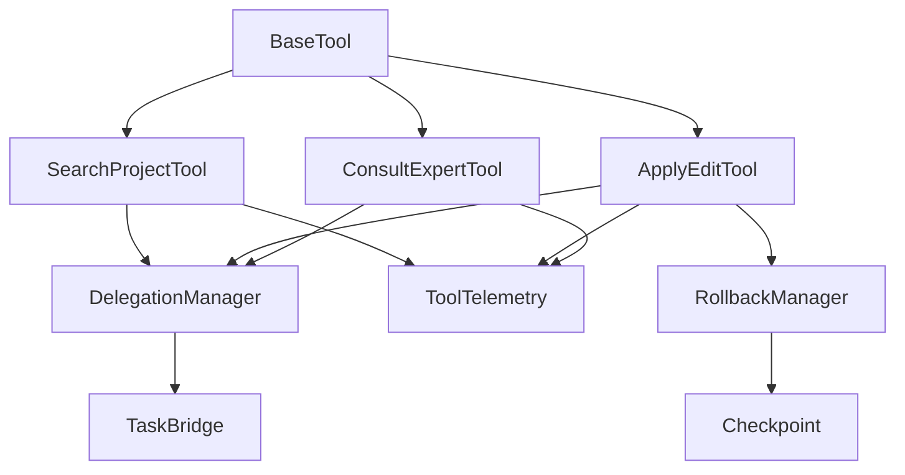

# 代码实现计划

## 1. 实现概览

### 1.1 项目结构

```
src/
├── core/
│   ├── tools/                      # 新工具实现
│   │   ├── BaseTool.ts             # 工具基类
│   │   ├── SearchProjectTool.ts   # 搜索工具
│   │   ├── ApplyEditTool.ts        # 编辑工具
│   │   ├── ConsultExpertTool.ts    # 专家工具
│   │   ├── registry.ts             # 工具注册表
│   │   └── index.ts                # 导出
│   │
│   ├── prompts/                     # 提示词管理
│   │   ├── system.ts               # 主模型提示词
│   │   ├── ask-mode.ts             # Ask 模式提示词
│   │   ├── code-mode.ts            # Code 模式提示词
│   │   ├── expert-mode.ts          # Expert 模式提示词
│   │   └── index.ts                # 导出
│   │
│   ├── delegation/                  # 委派机制
│   │   ├── delegation-manager.ts   # 委派管理器
│   │   ├── task-bridge.ts          # 任务桥接器
│   │   └── index.ts                # 导出
│   │
│   ├── telemetry/                   # 遥测
│   │   ├── tools.ts                # 工具遥测
│   │   ├── metrics.ts              # 指标收集
│   │   └── index.ts                # 导出
│   │
│   └── rollback/                    # 回滚机制
│       ├── checkpoint.ts           # 记录点管理
│       ├── rollback-manager.ts     # 回滚管理器
│       └── index.ts                # 导出
│
├── shared/
│   ├── config.ts                   # 配置管理
│   ├── types.ts                    # 类型定义
│   └── constants.ts                # 常量定义
│
└── extension/
    └── providers/
        └── ClineProvider.ts        # 主要提供者（修改）
```

### 1.2 依赖关系



## 2. 核心模块实现

### 2.1 工具基类（BaseTool）

```typescript
// src/core/tools/BaseTool.ts
import { Task } from "../task/Task"
import { ClineProvider } from "../../extension/providers/ClineProvider"
import { ToolResult, ToolContext } from "../../shared/types"

export abstract class BaseTool<TToolName extends string> {
	constructor(
		protected readonly task: Task,
		protected readonly provider: ClineProvider,
		protected readonly toolName: TToolName,
	) {}

	/**
	 * 执行工具的主方法
	 */
	abstract execute(params: unknown, context?: ToolContext): Promise<ToolResult>

	/**
	 * 验证参数
	 */
	protected validateParams(params: unknown, schema: any): void {
		// 参数验证逻辑
		// 可以使用 JSON Schema 或自定义验证
	}

	/**
	 * 记录工具调用开始
	 */
	protected async logStart(params: unknown): Promise<void> {
		await this.provider.telemetry.trackToolStart({
			toolName: this.toolName,
			params,
			taskId: this.task.taskId,
			timestamp: Date.now(),
		})
	}

	/**
	 * 记录工具调用完成
	 */
	protected async logComplete(result: ToolResult): Promise<void> {
		await this.provider.telemetry.trackToolComplete({
			toolName: this.toolName,
			result,
			taskId: this.task.taskId,
			timestamp: Date.now(),
		})
	}

	/**
	 * 记录工具调用错误
	 */
	protected async logError(error: Error): Promise<void> {
		await this.provider.telemetry.trackToolError({
			toolName: this.toolName,
			error: error.message,
			stackTrace: error.stack,
			taskId: this.task.taskId,
			timestamp: Date.now(),
		})
	}

	/**
	 * 带错误处理的执行
	 */
	protected async executeWithErrorHandling<T>(fn: () => Promise<T>): Promise<T | ToolResult> {
		try {
			return await fn()
		} catch (error) {
			await this.logError(error as Error)
			return {
				success: false,
				summary: `操作失败: ${(error as Error).message}`,
				error: {
					code: this.classifyError(error as Error),
					message: (error as Error).message,
					recoverable: this.isRecoverable(error as Error),
				},
			}
		}
	}

	private classifyError(error: Error): string {
		const message = error.message.toLowerCase()

		if (message.includes("timeout")) return "TIMEOUT"
		if (message.includes("permission")) return "PERMISSION_DENIED"
		if (message.includes("not found")) return "FILE_NOT_FOUND"
		if (message.includes("validation")) return "VALIDATION_FAILED"

		return "INTERNAL_ERROR"
	}

	private isRecoverable(error: Error): boolean {
		const code = this.classifyError(error)
		return ["TIMEOUT", "VALIDATION_FAILED", "INTERNAL_ERROR"].includes(code)
	}
}
```

### 2.2 SearchProjectTool 实现

```typescript
// src/core/tools/SearchProjectTool.ts
import { BaseTool } from "./BaseTool"
import { SearchProjectParams, SearchProjectResult, Finding } from "../../shared/types"

export class SearchProjectTool extends BaseTool<"search_project"> {
	async execute(params: SearchProjectParams): Promise<SearchProjectResult> {
		await this.logStart(params)

		try {
			// 步骤 1: 验证参数
			this.validateParams(params)

			// 步骤 2: 构建子任务消息
			const taskMessage = this.buildSearchMessage(params)

			// 步骤 3: 委派到 ask 模式的子任务
			const childTaskId = await this.provider.delegationManager.delegate({
				parentTaskId: this.task.taskId,
				message: taskMessage,
				mode: "ask",
				customInstructions: this.buildAskModeInstructions(params),
				toolContext: {
					depth: 0,
					maxDepth: 2,
					parentTool: "search_project",
				},
			})

			// 步骤 4: 等待子任务完成
			const completion = await this.waitForChildCompletion(childTaskId)

			// 步骤 5: 解析结果
			let result: SearchProjectResult

			if (params.schema) {
				result = this.extractStructuredData(completion, params.schema)
			} else {
				result = this.parseSearchResult(completion)
			}

			await this.logComplete(result)
			return result
		} catch (error) {
			const errorResult = await this.executeWithErrorHandling(async () => {
				throw error
			})
			return errorResult as SearchProjectResult
		}
	}

	private buildSearchMessage(params: SearchProjectParams): string {
		let message = `你需要调查项目并回答以下问题：\n\n${params.query}`

		if (params.scope?.directories) {
			message += `\n\n**搜索范围：** ${params.scope.directories.join(", ")}`
		}

		if (params.scope?.filePatterns) {
			message += `\n**文件模式：** ${params.scope.filePatterns.join(", ")}`
		}

		if (params.scope?.excludes) {
			message += `\n**排除模式：** ${params.scope.excludes.join(", ")}`
		}

		return message
	}

	private buildAskModeInstructions(params: SearchProjectParams): string {
		return `
你在一个只读的调查任务中执行。

**你的工具权限：**
- ✅ read_file
- ✅ search_files
- ✅ list_files
- ✅ codebase_search
- ❌ write_to_file（禁止任何编辑操作）
- ❌ apply_diff（禁止任何编辑操作）
- ❌ consultExpert（禁止递归调用）
- ❌ applyEdit（禁止递归调用）

**你的任务：**
1. 调查项目以回答问题
2. 使用 search_files 和 codebase_search 查找相关代码
3. 使用 read_file 阅读关键文件
4. 使用 list_files 了解项目结构
${params.schema ? "5. 按提供的 schema 格式返回结构化数据" : "5. 提供结构化的调查报告"}
6. 完成后使用 attempt_completion 返回结果

**输出要求：**
${params.schema ? "严格按照 schema 格式返回 JSON 数据" : "提供清晰的结构化报告，包含相关代码片段和文件路径"}
		`.trim()
	}

	private async waitForChildCompletion(childTaskId: string): Promise<TaskCompletion> {
		return await this.provider.delegationManager.waitForCompletion(childTaskId)
	}

	private parseSearchResult(completion: TaskCompletion): SearchProjectResult {
		// 解析子任务返回的结果
		const content = completion.message || ""

		return {
			success: true,
			summary: this.extractSummary(content),
			findings: this.extractFindings(content),
		}
	}

	private extractStructuredData(completion: TaskCompletion, schema: any): SearchProjectResult {
		// 从完成消息中提取结构化数据
		const content = completion.message || ""
		const structuredData = this.parseJson(content)

		return {
			success: true,
			summary: "结构化数据提取成功",
			findings: [],
			structuredData,
		}
	}

	private extractSummary(content: string): string {
		// 提取摘要
		const lines = content.split("\n").filter((l) => l.trim())
		return lines[0] || "调查完成"
	}

	private extractFindings(content: string): Finding[] {
		// 提取发现
		const findings: Finding[] = []

		// 提取文件引用
		const filePattern = /([a-zA-Z0-9_/\-]+\.(ts|tsx|js|jsx|py|java|go|rs))/g
		const matches = content.match(filePattern) || []

		const uniqueFiles = [...new Set(matches)]
		for (const file of uniqueFiles) {
			findings.push({
				type: "file",
				path: file,
				description: `相关文件: ${file}`,
			})
		}

		return findings
	}

	private parseJson(content: string): any {
		// 尝试解析 JSON
		const jsonMatch = content.match(/\{[\s\S]*\}/)
		if (!jsonMatch) {
			throw new Error("无法从响应中提取 JSON 数据")
		}

		return JSON.parse(jsonMatch[0])
	}
}
```

### 2.3 ApplyEditTool 实现

```typescript
// src/core/tools/ApplyEditTool.ts
import { BaseTool } from "./BaseTool"
import { ApplyEditParams, ApplyEditResult } from "../../shared/types"
import { RollbackManager } from "../rollback/rollback-manager"

export class ApplyEditTool extends BaseTool<"apply_edit"> {
	constructor(
		task: Task,
		provider: ClineProvider,
		private readonly rollbackManager: RollbackManager,
	) {
		super(task, provider, "apply_edit")
	}

	async execute(params: ApplyEditParams): Promise<ApplyEditResult> {
		await this.logStart(params)

		// 步骤 1: 验证参数
		this.validateParams(params)

		// 步骤 2: 创建记录点
		const checkpointId = await this.rollbackManager.createCheckpoint()

		try {
			// 步骤 3: 构建编辑任务消息
			const taskMessage = this.buildEditMessage(params)

			// 步骤 4: 委派到 code 模式的子任务
			const childTaskId = await this.provider.delegationManager.delegate({
				parentTaskId: this.task.taskId,
				message: taskMessage,
				mode: "code",
				customInstructions: this.buildCodeModeInstructions(params),
				initialTodos: this.buildTodos(params),
				toolContext: {
					depth: 0,
					maxDepth: 1,
					parentTool: "apply_edit",
					checkpointId,
				},
			})

			// 步骤 5: 等待子任务完成
			const completion = await this.waitForChildCompletion(childTaskId)

			// 步骤 6: 收集修改的文件
			const filesModified = await this.collectModifiedFiles(checkpointId)

			// 步骤 7: 可选的校验
			if (params.validate !== false) {
				const validation = await this.runValidation(filesModified)
				if (!validation.passed) {
					// 校验失败，回滚
					await this.rollbackManager.rollback(checkpointId)
					const errorResult = {
						success: false,
						summary: "代码校验失败",
						filesModified: [],
						validationPassed: false,
						errors: validation.errors,
					}
					await this.logComplete(errorResult)
					return errorResult
				}
			}

			const result: ApplyEditResult = {
				success: true,
				summary: completion.message || "编辑完成",
				filesModified,
				validationPassed: true,
			}

			await this.logComplete(result)
			return result
		} catch (error) {
			// 发生错误，回滚
			await this.rollbackManager.rollback(checkpointId)
			const errorResult = await this.executeWithErrorHandling(async () => {
				throw error
			})
			return errorResult as ApplyEditResult
		}
	}

	private buildEditMessage(params: ApplyEditParams): string {
		let message = `你需要按照以下指令编辑代码：\n\n**指令：**\n${params.instruction}`

		if (params.files && params.files.length > 0) {
			message += `\n\n**需要修改的文件：**\n${params.files.map((f) => `- ${f}`).join("\n")}`
		}

		if (params.context) {
			message += `\n\n**额外上下文：**\n${params.context}`
		}

		return message
	}

	private buildCodeModeInstructions(params: ApplyEditParams): string {
		let instructions = `
你在一个代码编辑任务中执行。

**你的工具权限：**
- ✅ read_file
- ✅ write_to_file
- ✅ apply_diff
- ✅ search_files
- ✅ list_files
- ❌ consultExpert（禁止递归调用）
- ❌ searchProject（禁止递归调用）

**你的任务：**
1. 理解编辑指令
2. 使用 read_file 阅读需要修改的文件
3. 使用 write_to_file 或 apply_diff 进行修改
4. 完成后使用 attempt_completion 返回结果

**返回要求：**
- 提供修改摘要
- 列出所有修改的文件
		`.trim()

		if (params.files && params.files.length > 0) {
			instructions += `\n\n**文件限制：**\n你只能修改以下文件：\n${params.files.map((f) => `- ${f}`).join("\n")}`
		}

		return instructions
	}

	private buildTodos(params: ApplyEditParams): string[] {
		const todos: string[] = ["理解编辑指令"]

		if (params.files) {
			todos.push(`阅读文件: ${params.files.join(", ")}`)
		}

		todos.push("进行代码修改")
		todos.push("完成编辑")

		return todos
	}

	private async waitForChildCompletion(childTaskId: string): Promise<TaskCompletion> {
		return await this.provider.delegationManager.waitForCompletion(childTaskId)
	}

	private async collectModifiedFiles(checkpointId: string): Promise<string[]> {
		return await this.rollbackManager.getModifiedFiles(checkpointId)
	}

	private async runValidation(files: string[]): Promise<{
		passed: boolean
		errors: string[]
	}> {
		const errors: string[] = []

		// 运行 lint
		try {
			await this.provider.executeCommand("npm run lint", {
				timeout: 60000,
			})
		} catch (error) {
			errors.push(`Lint 错误: ${(error as Error).message}`)
		}

		// 运行类型检查
		try {
			await this.provider.executeCommand("npm run type-check", {
				timeout: 120000,
			})
		} catch (error) {
			errors.push(`类型检查错误: ${(error as Error).message}`)
		}

		return {
			passed: errors.length === 0,
			errors,
		}
	}
}
```

### 2.4 ConsultExpertTool 实现

```typescript
// src/core/tools/ConsultExpertTool.ts
import { BaseTool } from "./BaseTool"
import { ConsultExpertParams, ConsultExpertResult } from "../../shared/types"

export class ConsultExpertTool extends BaseTool<"consult_expert"> {
	async execute(params: ConsultExpertParams): Promise<ConsultExpertResult> {
		await this.logStart(params)

		try {
			// 步骤 1: 验证参数
			this.validateParams(params)

			// 步骤 2: 根据 domain 构建专家角色
			const expertPrompt = this.buildExpertPrompt(params.domain, params.outputFormat)

			// 步骤 3: 构建咨询消息
			const taskMessage = this.buildConsultMessage(params)

			// 步骤 4: 委派到 expert 模式的子任务
			const childTaskId = await this.provider.delegationManager.delegate({
				parentTaskId: this.task.taskId,
				message: taskMessage,
				mode: "expert",
				customInstructions: this.buildExpertModeInstructions(params),
				modeOverrides: {
					roleDefinition: expertPrompt,
				},
				toolContext: {
					depth: 0,
					maxDepth: 2,
					parentTool: "consult_expert",
				},
			})

			// 步骤 5: 等待子任务完成
			const completion = await this.waitForChildCompletion(childTaskId)

			// 步骤 6: 解析专家意见
			const result = this.parseExpertOpinion(completion, params.outputFormat)

			await this.logComplete(result)
			return result
		} catch (error) {
			const errorResult = await this.executeWithErrorHandling(async () => {
				throw error
			})
			return errorResult as ConsultExpertResult
		}
	}

	private buildExpertPrompt(domain: string, outputFormat?: string): string {
		let prompt = `你是一位 ${domain} 领域的资深专家。`

		if (outputFormat === "design") {
			prompt += `\n\n你擅长架构设计和技术方案设计。你的输出应该清晰、可执行、考虑周全。`
		} else if (outputFormat === "comparison") {
			prompt += `\n\n你擅长技术方案对比和分析。你的输出应该客观、基于事实、给出明确建议。`
		} else if (outputFormat === "recommendation") {
			prompt += `\n\n你擅长提供实践建议和最佳实践。你的输出应该具体、可操作、有优先级。`
		}

		prompt += `

**你的角色：**
- 基于专业知识提供深思熟虑的建议
- 考虑多种方案和权衡
- 识别潜在风险和注意事项
- 提供清晰、可执行的建议

**你的限制：**
- 不能修改任何文件
- 不能执行任何代码
- 只能进行分析和建议
		`.trim()

		return prompt
	}

	private buildConsultMessage(params: ConsultExpertParams): string {
		let message = `**主题：** ${params.topic}\n\n**问题：** ${params.question}`

		if (params.attachments && params.attachments.length > 0) {
			message += `\n\n**附件：**\n${params.attachments.map((a) => `- ${a}`).join("\n")}`
		}

		return message
	}

	private buildExpertModeInstructions(params: ConsultExpertParams): string {
		return `
你在一个专家咨询任务中执行。

**你的工具权限：**
- ✅ read_file
- ✅ search_files
- ✅ list_files
- ✅ codebase_search
- ✅ searchProject
- ❌ write_to_file（禁止编辑）
- ❌ apply_diff（禁止编辑）
- ❌ consultExpert（禁止递归）
- ❌ applyEdit（禁止编辑）

**你的任务：**
1. 理解咨询主题和问题
2. 使用 searchProject 和 read_file 了解相关上下文
3. 基于你的专业领域知识提供深入分析
4. 考虑多种方案，识别风险
5. 使用 attempt_completion 返回你的意见

**输出格式要求：**
- 提供简明的意见摘要
- 列出具体的建议
- 识别注意事项和风险点

**输出格式：** ${params.outputFormat || "analysis"}
		`.trim()
	}

	private async waitForChildCompletion(childTaskId: string): Promise<TaskCompletion> {
		return await this.provider.delegationManager.waitForCompletion(childTaskId)
	}

	private parseExpertOpinion(completion: TaskCompletion, outputFormat?: string): ConsultExpertResult {
		const content = completion.message || ""

		// 根据输出格式解析结果
		switch (outputFormat) {
			case "analysis":
				return this.parseAnalysis(content)
			case "design":
				return this.parseDesign(content)
			case "comparison":
				return this.parseComparison(content)
			case "recommendation":
				return this.parseRecommendation(content)
			default:
				return this.parseAnalysis(content)
		}
	}

	private parseAnalysis(content: string): ConsultExpertResult {
		const opinion = this.extractSection(content, "opinion", "summary") || content.slice(0, 200)
		const analysis = this.extractSection(content, "analysis", "详细分析") || ""
		const recommendations = this.extractList(content, "recommendations", "建议")
		const caveats = this.extractList(content, "caveats", "注意事项")

		return {
			success: true,
			opinion,
			analysis,
			recommendations,
			caveats,
		}
	}

	private parseDesign(content: string): ConsultExpertResult {
		const opinion = this.extractSection(content, "opinion", "摘要") || content.slice(0, 200)
		const recommendations = this.extractList(content, "recommendations", "建议")
		const caveats = this.extractList(content, "caveats", "注意事项")

		return {
			success: true,
			opinion,
			recommendations,
			caveats,
		}
	}

	private parseComparison(content: string): ConsultExpertResult {
		const opinion = this.extractSection(content, "opinion", "结论") || content.slice(0, 200)
		const recommendations = [this.extractSection(content, "recommendation", "推荐") || ""].filter(Boolean)
		const caveats = this.extractList(content, "caveats", "注意事项")

		return {
			success: true,
			opinion,
			recommendations,
			caveats,
		}
	}

	private parseRecommendation(content: string): ConsultExpertResult {
		const opinion = this.extractSection(content, "opinion", "总结") || content.slice(0, 200)
		const recommendations = this.extractList(content, "recommendations", "建议")
		const caveats = this.extractList(content, "caveats", "注意事项")

		return {
			success: true,
			opinion,
			recommendations,
			caveats,
		}
	}

	private extractSection(content: string, ...keywords: string[]): string | undefined {
		for (const keyword of keywords) {
			const regex = new RegExp(`\\*\\*${keyword}\\*\\*[:：]?\\s*([\\s\\S]*?)(?=\\n\\n\\*\\*|$)`, "i")
			const match = content.match(regex)
			if (match) {
				return match[1].trim()
			}
		}
		return undefined
	}

	private extractList(content: string, ...keywords: string[]): string[] {
		const section = this.extractSection(content, ...keywords)
		if (!section) return []

		const items: string[] = []
		const lines = section.split("\n")

		for (const line of lines) {
			const trimmed = line.trim()
			if (trimmed.startsWith("- ") || trimmed.startsWith("• ") || /^\d+\./.test(trimmed)) {
				items.push(trimmed.replace(/^[•\-]\s|^\d+\.\s/, "").trim())
			}
		}

		return items
	}
}
```

### 2.5 工具注册表

```typescript
// src/core/tools/registry.ts
import { Tool } from "../../shared/types"
import { SearchProjectTool } from "./SearchProjectTool"
import { ApplyEditTool } from "./ApplyEditTool"
import { ConsultExpertTool } from "./ConsultExpertTool"

export class ToolRegistry {
	private tools: Map<string, Tool> = new Map()

	constructor(
		private readonly task: Task,
		private readonly provider: ClineProvider,
	) {
		this.registerTools()
	}

	private registerTools(): void {
		this.register(new SearchProjectTool(this.task, this.provider))
		this.register(new ApplyEditTool(this.task, this.provider, this.provider.rollbackManager))
		this.register(new ConsultExpertTool(this.task, this.provider))
	}

	register(tool: Tool): void {
		this.tools.set(tool.name, tool)
	}

	unregister(toolName: string): void {
		this.tools.delete(toolName)
	}

	get(toolName: string): Tool | undefined {
		return this.tools.get(toolName)
	}

	has(toolName: string): boolean {
		return this.tools.has(toolName)
	}

	list(): Tool[] {
		return Array.from(this.tools.values())
	}

	async execute(toolName: string, params: unknown, context?: any): Promise<ToolResult> {
		const tool = this.tools.get(toolName)
		if (!tool) {
			throw new Error(`工具不存在: ${toolName}`)
		}

		return await tool.execute(params, context)
	}

	async executeWithFilter(toolName: string, params: unknown, context?: any): Promise<ToolResult> {
		// 检查工具调用是否被允许
		if (!this.isToolCallAllowed(toolName, context)) {
			throw new Error(`工具调用被禁止: ${toolName}`)
		}

		return await this.execute(toolName, params, context)
	}

	private isToolCallAllowed(toolName: string, context?: any): boolean {
		if (!context) return true

		const { depth, parentTool, maxDepth } = context

		// 深度检查
		if (depth >= maxDepth) {
			return false
		}

		// 递归检查
		if (parentTool === toolName) {
			return false
		}

		// 权限矩阵
		const permissionMatrix: Record<string, string[]> = {
			main: ["search_project", "apply_edit", "consult_expert", "attempt_completion"],
			search_project: ["search_project"],
			apply_edit: [],
			consult_expert: ["search_project"],
		}

		const allowedTools = permissionMatrix[parentTool] || permissionMatrix.main
		return allowedTools.includes(toolName)
	}
}
```

## 3. 委派机制实现

### 3.1 委派管理器

```typescript
// src/core/delegation/delegation-manager.ts
import { Task } from "../task/Task"

export interface DelegationOptions {
	parentTaskId: string
	message: string
	mode: "ask" | "code" | "expert"
	customInstructions?: string
	modeOverrides?: {
		roleDefinition?: string
	}
	initialTodos?: string[]
	toolContext?: {
		depth: number
		maxDepth: number
		parentTool?: string
		checkpointId?: string
	}
}

export interface TaskCompletion {
	taskId: string
	message: string
	status: "completed" | "failed" | "cancelled"
	timestamp: number
}

export class DelegationManager {
	constructor(private readonly provider: ClineProvider) {}

	async delegate(options: DelegationOptions): Promise<string> {
		// 构建子任务
		const childTask = await this.createChildTask(options)

		// 打开子任务
		await this.openChildTask(childTask, options)

		return childTask.taskId
	}

	private async createChildTask(options: DelegationOptions): Promise<Task> {
		// 使用现有的委派机制创建子任务
		return await this.provider.createTask({
			...options,
			type: "subtask",
		})
	}

	private async openChildTask(task: Task, options: DelegationOptions): Promise<void> {
		// 使用现有的委派机制打开子任务
		await this.provider.openTask(task.taskId, {
			mode: options.mode,
			message: options.message,
			customInstructions: options.customInstructions,
			modeOverrides: options.modeOverrides,
			initialTodos: options.initialTodos,
		})
	}

	async waitForCompletion(childTaskId: string): Promise<TaskCompletion> {
		return await this.provider.waitForTaskCompletion(childTaskId)
	}

	async reopenParent(parentTaskId: string): Promise<void> {
		await this.provider.reopenTask(parentTaskId)
	}

	async cancel(childTaskId: string): Promise<void> {
		await this.provider.cancelTask(childTaskId)
	}
}
```

## 4. 回滚机制实现

### 4.1 记录点管理

```typescript
// src/core/rollback/checkpoint.ts
export interface Checkpoint {
	id: string
	timestamp: number
	taskId: string
	initialState: CheckpointState
}

export interface CheckpointState {
	files: Record<string, string> // 文件路径 -> 文件内容
	directories: string[]
}

export class CheckpointManager {
	private checkpoints: Map<string, Checkpoint> = new Map()

	async createCheckpoint(taskId: string): Promise<string> {
		const id = `cp-${taskId}-${Date.now()}`

		const state = await this.captureState()

		const checkpoint: Checkpoint = {
			id,
			timestamp: Date.now(),
			taskId,
			initialState: state,
		}

		this.checkpoints.set(id, checkpoint)

		return id
	}

	private async captureState(): Promise<CheckpointState> {
		// 捕获当前状态
		// 这里简化实现，实际可能需要 git 或其他机制

		return {
			files: {},
			directories: [],
		}
	}

	async rollback(checkpointId: string): Promise<void> {
		const checkpoint = this.checkpoints.get(checkpointId)
		if (!checkpoint) {
			throw new Error(`记录点不存在: ${checkpointId}`)
		}

		await this.restoreState(checkpoint.initialState)
	}

	private async restoreState(state: CheckpointState): Promise<void> {
		// 恢复到记录点状态
		// 这里简化实现，实际可能需要 git reset 或其他机制
	}

	async getModifiedFiles(checkpointId: string): Promise<string[]> {
		const checkpoint = this.checkpoints.get(checkpointId)
		if (!checkpoint) {
			return []
		}

		const currentState = await this.captureState()
		return this.getDiffFiles(checkpoint.initialState, currentState)
	}

	private getDiffFiles(before: CheckpointState, after: CheckpointState): string[] {
		// 比较两个状态，返回修改的文件
		// 这里简化实现
		return []
	}

	async cleanup(checkpointId: string): Promise<void> {
		this.checkpoints.delete(checkpointId)
	}

	async cleanupOld(olderThan: number): Promise<void> {
		const now = Date.now()
		for (const [id, checkpoint] of this.checkpoints.entries()) {
			if (now - checkpoint.timestamp > olderThan) {
				this.checkpoints.delete(id)
			}
		}
	}
}
```

### 4.2 回滚管理器

```typescript
// src/core/rollback/rollback-manager.ts
import { CheckpointManager } from "./checkpoint"

export class RollbackManager {
	constructor(private readonly checkpointManager: CheckpointManager) {}

	async createCheckpoint(): Promise<string> {
		const taskId = this.getCurrentTaskId()
		return await this.checkpointManager.createCheckpoint(taskId)
	}

	async rollback(checkpointId: string): Promise<void> {
		await this.checkpointManager.rollback(checkpointId)
	}

	async getModifiedFiles(checkpointId: string): Promise<string[]> {
		return await this.checkpointManager.getModifiedFiles(checkpointId)
	}

	async cleanup(checkpointId: string): Promise<void> {
		await this.checkpointManager.cleanup(checkpointId)
	}

	async cleanupOld(): Promise<void> {
		// 清理 24 小时前的记录点
		await this.checkpointManager.cleanupOld(24 * 60 * 60 * 1000)
	}

	private getCurrentTaskId(): string {
		// 获取当前任务 ID
		// 这里需要根据实际情况实现
		return "current-task-id"
	}
}
```

## 5. 遥测实现

### 5.1 工具遥测

```typescript
// src/core/telemetry/tools.ts
export interface ToolEvent {
	toolName: string
	eventType: "start" | "complete" | "error"
	taskId: string
	timestamp: number
	params?: unknown
	result?: ToolResult
	error?: {
		code: string
		message: string
		stackTrace?: string
	}
	architecture: "old" | "new" | "hybrid"
}

export class ToolTelemetry {
	private events: ToolEvent[] = []

	async trackToolStart(event: Omit<ToolEvent, "eventType" | "architecture">): Promise<void> {
		await this.recordEvent({
			...event,
			eventType: "start",
			architecture: this.detectArchitecture(),
		})
	}

	async trackToolComplete(event: Omit<ToolEvent, "eventType" | "architecture">): Promise<void> {
		await this.recordEvent({
			...event,
			eventType: "complete",
			architecture: this.detectArchitecture(),
		})
	}

	async trackToolError(event: Omit<ToolEvent, "eventType" | "architecture">): Promise<void> {
		await this.recordEvent({
			...event,
			eventType: "error",
			architecture: this.detectArchitecture(),
		})
	}

	private async recordEvent(event: ToolEvent): Promise<void> {
		this.events.push(event)

		// 发送到遥测系统
		await this.sendToTelemetrySystem(event)
	}

	private async sendToTelemetrySystem(event: ToolEvent): Promise<void> {
		// 实现遥测数据发送
		// 可以发送到分析平台、日志系统等
	}

	private detectArchitecture(): "old" | "new" | "hybrid" {
		// 检测当前使用的架构
		// 这里需要根据实际情况实现
		return "new"
	}

	async getMetrics(period: TimeRange): Promise<ToolMetrics> {
		const events = this.events.filter((e) => e.timestamp >= period.start && e.timestamp <= period.end)

		return {
			totalCalls: events.length,
			successRate: this.calculateSuccessRate(events),
			errorRate: this.calculateErrorRate(events),
			avgDuration: this.calculateAvgDuration(events),
			toolUsage: this.calculateToolUsage(events),
		}
	}

	private calculateSuccessRate(events: ToolEvent[]): number {
		const completed = events.filter((e) => e.eventType === "complete").length
		const total = events.filter((e) => e.eventType === "start").length
		return total > 0 ? completed / total : 0
	}

	private calculateErrorRate(events: ToolEvent[]): number {
		const errors = events.filter((e) => e.eventType === "error").length
		const total = events.filter((e) => e.eventType === "start").length
		return total > 0 ? errors / total : 0
	}

	private calculateAvgDuration(events: ToolEvent[]): number {
		// 计算平均执行时间
		// 需要配对 start 和 complete 事件
		return 0
	}

	private calculateToolUsage(events: ToolEvent[]): Record<string, number> {
		const usage: Record<string, number> = {}

		for (const event of events) {
			if (event.eventType === "start") {
				usage[event.toolName] = (usage[event.toolName] || 0) + 1
			}
		}

		return usage
	}
}

export interface ToolMetrics {
	totalCalls: number
	successRate: number
	errorRate: number
	avgDuration: number
	toolUsage: Record<string, number>
}

export interface TimeRange {
	start: number
	end: number
}
```

## 6. 配置管理

### 6.1 配置结构

```typescript
// src/shared/config.ts
export interface RooCodeConfig {
	/**
	 * 是否启用新的 Agent as Tools 架构
	 * @default false
	 */
	agentAsToolsEnabled?: boolean

	/**
	 * A/B 测试分组（0-100）
	 * 0-49: 使用旧架构
	 * 50-100: 使用新架构
	 * @default 0
	 */
	abTestGroup?: number

	/**
	 * 强制使用特定工具
	 */
	forceTools?: {
		searchProject?: boolean
		applyEdit?: boolean
		consultExpert?: boolean
	}

	/**
	 * 工具超时配置
	 */
	toolTimeouts?: {
		searchProject: number
		applyEdit: number
		consultExpert: number
	}

	/**
	 * 回滚配置
	 */
	rollback?: {
		enabled: boolean
		cleanupInterval: number // 毫秒
		maxAge: number // 毫秒
	}

	/**
	 * 遥测配置
	 */
	telemetry?: {
		enabled: boolean
		sampleRate: number
	}
}

export class ConfigManager {
	private config: RooCodeConfig = {
		agentAsToolsEnabled: false,
		abTestGroup: 0,
		forceTools: {},
		toolTimeouts: {
			searchProject: 60000, // 60 秒
			applyEdit: 180000, // 3 分钟
			consultExpert: 120000, // 2 分钟
		},
		rollback: {
			enabled: true,
			cleanupInterval: 60 * 60 * 1000, // 1 小时
			maxAge: 24 * 60 * 60 * 1000, // 24 小时
		},
		telemetry: {
			enabled: true,
			sampleRate: 1.0,
		},
	}

	constructor(private readonly storage?: any) {}

	async load(): Promise<void> {
		if (this.storage) {
			const saved = await this.storage.getConfig()
			if (saved) {
				this.config = { ...this.config, ...saved }
			}
		}
	}

	async save(): Promise<void> {
		if (this.storage) {
			await this.storage.saveConfig(this.config)
		}
	}

	get<K extends keyof RooCodeConfig>(key: K): RooCodeConfig[K] {
		return this.config[key]
	}

	async set<K extends keyof RooCodeConfig>(key: K, value: RooCodeConfig[K]): Promise<void> {
		this.config[key] = value
		await this.save()
	}

	isNewArchitectureEnabled(): boolean {
		// 显式开关优先
		if (this.config.agentAsToolsEnabled !== undefined) {
			return this.config.agentAsToolsEnabled
		}

		// A/B 测试分组
		if (this.config.abTestGroup !== undefined) {
			return this.config.abTestGroup >= 50
		}

		// 默认使用旧架构
		return false
	}

	getToolTimeout(toolName: string): number {
		return this.config.toolTimeouts?.[toolName as keyof typeof this.config.toolTimeouts] || 60000
	}

	isToolForced(toolName: string): boolean | undefined {
		return this.config.forceTools?.[toolName as keyof typeof this.config.forceTools]
	}
}
```

## 7. 类型定义

```typescript
// src/shared/types.ts

// 工具相关类型
export interface Tool {
	name: string
	execute(params: unknown, context?: any): Promise<ToolResult>
}

export interface ToolResult {
	success: boolean
	summary: string
	error?: {
		code: string
		message: string
		recoverable: boolean
	}
	stats?: {
		tokensUsed: number
		durationMs: number
	}
}

export interface ToolContext {
	depth: number
	maxDepth: number
	parentTool?: string
	checkpointId?: string
}

// 搜索工具类型
export interface SearchProjectParams {
	query: string
	scope?: {
		directories?: string[]
		filePatterns?: string[]
		excludes?: string[]
	}
	schema?: any
}

export interface SearchProjectResult extends ToolResult {
	findings: Finding[]
	structuredData?: unknown
}

export interface Finding {
	type: "file" | "function" | "class" | "concept"
	path?: string
	name?: string
	description: string
}

// 编辑工具类型
export interface ApplyEditParams {
	instruction: string
	files?: string[]
	context?: string
	validate?: boolean
}

export interface ApplyEditResult extends ToolResult {
	filesModified: string[]
	validationPassed: boolean
}

// 专家工具类型
export interface ConsultExpertParams {
	domain: string
	topic: string
	question: string
	attachments?: string[]
	outputFormat?: "analysis" | "design" | "comparison" | "recommendation"
}

export interface ConsultExpertResult extends ToolResult {
	opinion: string
	analysis?: string
	recommendations: string[]
	caveats?: string[]
}

// 任务相关类型
export interface Task {
	taskId: string
	type: "main" | "subtask"
	status: "active" | "completed" | "failed" | "cancelled"
}

export interface TaskCompletion {
	taskId: string
	message: string
	status: "completed" | "failed" | "cancelled"
	timestamp: number
}
```

## 8. 集成到现有系统

### 8.1 修改 ClineProvider

```typescript
// src/extension/providers/ClineProvider.ts (部分修改)

export class ClineProvider {
	private toolRegistry: ToolRegistry
	private configManager: ConfigManager
	private rollbackManager: RollbackManager

	constructor(/* ... */) {
		// 初始化管理器
		this.configManager = new ConfigManager(/* ... */)
		this.rollbackManager = new RollbackManager(/* ... */)
		this.toolRegistry = new ToolRegistry(/* ... */)

		// 加载配置
		this.configManager.load().catch(console.error)
	}

	async getAvailableTools() {
		if (this.configManager.isNewArchitectureEnabled()) {
			// 新工具组
			return [
				{
					name: "search_project",
					description: "搜索和调查项目代码",
					parameters: {
						/* ... */
					},
				},
				{
					name: "apply_edit",
					description: "编辑和修改代码",
					parameters: {
						/* ... */
					},
				},
				{
					name: "consult_expert",
					description: "咨询专家意见",
					parameters: {
						/* ... */
					},
				},
				{
					name: "attempt_completion",
					description: "完成任务",
					parameters: {
						/* ... */
					},
				},
			]
		} else {
			// 旧工具组
			return [
				{
					name: "new_task",
					description: "创建新的子任务",
					parameters: {
						/* ... */
					},
				},
				{
					name: "switch_mode",
					description: "切换任务模式",
					parameters: {
						/* ... */
					},
				},
				{
					name: "attempt_completion",
					description: "完成任务",
					parameters: {
						/* ... */
					},
				},
			]
		}
	}

	async executeTool(toolName: string, params: unknown): Promise<ToolResult> {
		if (this.configManager.isNewArchitectureEnabled()) {
			return await this.toolRegistry.executeWithFilter(toolName, params, this.getToolContext())
		} else {
			// 使用旧的工具执行逻辑
			return await this.executeLegacyTool(toolName, params)
		}
	}

	private getToolContext(): ToolContext {
		return {
			depth: 0,
			maxDepth: 3,
			parentTool: "main",
		}
	}
}
```

## 9. 测试策略

### 9.1 单元测试

```typescript
// src/core/tools/__tests__/SearchProjectTool.test.ts
import { describe, it, expect, beforeEach, vi } from "vitest"
import { SearchProjectTool } from "../SearchProjectTool"

describe("SearchProjectTool", () => {
	let tool: SearchProjectTool
	let mockProvider: any
	let mockTask: any

	beforeEach(() => {
		mockTask = { taskId: "test-task-id" }
		mockProvider = {
			delegationManager: {
				delegate: vi.fn(),
				waitForCompletion: vi.fn(),
			},
			telemetry: {
				trackToolStart: vi.fn(),
				trackToolComplete: vi.fn(),
				trackToolError: vi.fn(),
			},
		}
		tool = new SearchProjectTool(mockTask, mockProvider)
	})

	it("应该能够执行搜索", async () => {
		const params = {
			query: "找到所有处理用户认证的代码",
		}

		mockProvider.delegationManager.delegate.mockResolvedValue("child-task-id")
		mockProvider.delegationManager.waitForCompletion.mockResolvedValue({
			message: "找到 3 个相关文件",
			status: "completed",
		})

		const result = await tool.execute(params)

		expect(result.success).toBe(true)
		expect(mockProvider.delegationManager.delegate).toHaveBeenCalled()
	})

	it("应该支持 schema 参数", async () => {
		const params = {
			query: "列出所有 API 端点",
			schema: {
				type: "array",
				items: {
					type: "object",
					properties: {
						method: { type: "string" },
						path: { type: "string" },
					},
				},
			},
		}

		mockProvider.delegationManager.delegate.mockResolvedValue("child-task-id")
		mockProvider.delegationManager.waitForCompletion.mockResolvedValue({
			message: JSON.stringify([
				{ method: "GET", path: "/api/users" },
				{ method: "POST", path: "/api/users" },
			]),
			status: "completed",
		})

		const result = await tool.execute(params)

		expect(result.success).toBe(true)
		expect(result.structuredData).toBeDefined()
		expect(Array.isArray(result.structuredData)).toBe(true)
	})

	it("应该记录遥测事件", async () => {
		const params = { query: "test" }

		mockProvider.delegationManager.delegate.mockResolvedValue("child-task-id")
		mockProvider.delegationManager.waitForCompletion.mockResolvedValue({
			message: "test",
			status: "completed",
		})

		await tool.execute(params)

		expect(mockProvider.telemetry.trackToolStart).toHaveBeenCalled()
		expect(mockProvider.telemetry.trackToolComplete).toHaveBeenCalled()
	})
})
```

### 9.2 集成测试

```typescript
// src/core/tools/__tests__/integration.test.ts
import { describe, it, expect, beforeEach } from "vitest"
import { ToolRegistry } from "../registry"
import { ClineProvider } from "../../../extension/providers/ClineProvider"

describe("工具集成测试", () => {
	let registry: ToolRegistry
	let provider: ClineProvider

	beforeEach(() => {
		provider = new ClineProvider(/* ... */)
		registry = new ToolRegistry(/* ... */)
	})

	it("应该能够执行完整的搜索-编辑流程", async () => {
		// 步骤 1: 搜索
		const searchResult = await registry.execute("search_project", {
			query: "找到所有使用 deprecated API 的地方",
		})

		expect(searchResult.success).toBe(true)

		// 步骤 2: 编辑
		const editResult = await registry.execute("apply_edit", {
			instruction: "把 deprecated API 替换成新 API",
		})

		expect(editResult.success).toBe(true)
		expect(editResult.validationPassed).toBe(true)
	})

	it("应该防止递归调用", async () => {
		// 尝试在 searchProject 内部调用 applyEdit
		// 应该被工具过滤器拦截
		await expect(
			registry.executeWithFilter(
				"apply_edit",
				{ instruction: "test" },
				{ depth: 1, parentTool: "search_project", maxDepth: 2 },
			),
		).rejects.toThrow("工具调用被禁止")
	})
})
```

## 10. 性能优化

### 10.1 缓存策略

```typescript
// src/core/cache/tool-cache.ts
export class ToolResultCache {
	private cache: Map<string, CachedResult> = new Map()

	async get(key: string): Promise<CachedResult | undefined> {
		const cached = this.cache.get(key)
		if (!cached) return undefined

		// 检查是否过期
		if (Date.now() - cached.timestamp > cached.ttl) {
			this.cache.delete(key)
			return undefined
		}

		return cached
	}

	async set(key: string, result: ToolResult, ttl: number = 60000): Promise<void> {
		this.cache.set(key, {
			result,
			timestamp: Date.now(),
			ttl,
		})
	}

	async invalidate(pattern: string): Promise<void> {
		// 根据模式使缓存失效
		for (const key of this.cache.keys()) {
			if (key.includes(pattern)) {
				this.cache.delete(key)
			}
		}
	}

	async clear(): Promise<void> {
		this.cache.clear()
	}
}

interface CachedResult {
	result: ToolResult
	timestamp: number
	ttl: number
}
```

### 10.2 并行优化

```typescript
// src/core/tools/BaseTool.ts (添加)

export abstract class BaseTool<TToolName extends string> {
	// ... 现有代码

	protected async executeWithCache<T>(key: string, fn: () => Promise<T>, ttl?: number): Promise<T> {
		// 检查缓存
		const cached = await this.provider.cache.get(key)
		if (cached) {
			return cached.result as T
		}

		// 执行函数
		const result = await fn()

		// 缓存结果
		await this.provider.cache.set(key, result as ToolResult, ttl)

		return result
	}
}
```

## 11. 实施时间表

### Week 1-2: 核心功能开发

- [ ] 实现工具基类（BaseTool）
- [ ] 实现 SearchProjectTool
- [ ] 实现 ApplyEditTool
- [ ] 实现 ConsultExpertTool
- [ ] 实现工具注册表

### Week 3: 委派与回滚机制

- [ ] 实现委派管理器
- [ ] 实现记录点管理
- [ ] 实现回滚管理器

### Week 4: 配置与遥测

- [ ] 实现配置管理器
- [ ] 实现工具遥测
- [ ] 集成到 ClineProvider

### Week 5: 测试与优化

- [ ] 编写单元测试
- [ ] 编写集成测试
- [ ] 性能优化
- [ ] Bug 修复

### Week 6: 文档与发布

- [ ] 完善代码文档
- [ ] 更新用户文档
- [ ] 准备发布

---

## 附录：代码示例

### A. 完整的工具执行流程

```typescript
// 示例：完整的搜索-编辑-完成流程
async function completeTask(provider: ClineProvider) {
	// 步骤 1: 搜索
	const searchResult = await provider.executeTool("search_project", {
		query: "找到所有使用 deprecated API 的地方",
	})

	if (!searchResult.success) {
		throw new Error("搜索失败")
	}

	// 步骤 2: 编辑
	const editResult = await provider.executeTool("apply_edit", {
		instruction: "把 deprecated API 替换成新 API",
		validate: true,
	})

	if (!editResult.success) {
		throw new Error("编辑失败")
	}

	// 步骤 3: 完成
	await provider.executeTool("attempt_completion", {
		message: `任务完成！共修改了 ${editResult.filesModified.length} 个文件`,
	})
}
```

### B. 错误处理示例

```typescript
// 示例：处理工具错误
async function handleToolError(result: ToolResult) {
	if (!result.success && result.error) {
		switch (result.error.code) {
			case "TIMEOUT":
				console.log("操作超时，可以尝试简化请求")
				break
			case "PERMISSION_DENIED":
				console.log("操作被拒绝，请检查权限")
				break
			case "FILE_NOT_FOUND":
				console.log("文件不存在，请检查路径")
				break
			default:
				console.log(`错误: ${result.error.message}`)
		}

		if (result.error.recoverable) {
			console.log("此错误可以恢复，可以尝试重试")
		} else {
			console.log("此错误无法恢复，需要人工干预")
		}
	}
}
```

---

_最后更新: 2026-01-13_
